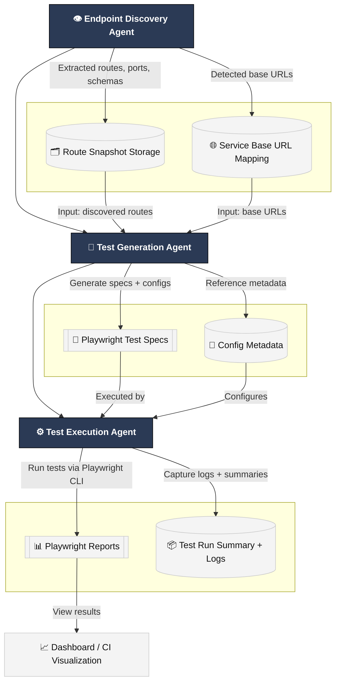

# 🤖 A.T.L.A.S
### API Testing Leveraging an Agentic System

## 📘 Overview
**Repository-agnostic** starter for discovering API endpoints, generating Playwright tests, and executing them with rich reports—works across frameworks (FastAPI/Flask, Express/Nest, Spring, Rails, etc.).

---

## 🧱 Architecture


## ✨ What This Provides
-Endpoint discovery: Inspects source code, docker-compose.yml, Dockerfiles, .env, proxy configs, and README to infer service base URLs (e.g., http://localhost:8080) and HTTP routes.
-Test generation: Produces Playwright API tests with correct BASE_URL per service and typed request/response assertions.
-Test execution: Runs via the Playwright CLI with HTML report, JSON summary, and artifacts (traces/screenshots).
-Storage: Snapshots routes + commits for reproducibility across runs.

## 📁 Layout 
```bash
.
├─ my_agent/                 # Google ADK orchestration + prompts/MCP wrappers
│  ├─ agent.py
│  ├─ mcp/
│  ├─ prompts/
│  └─ tools.py
├─ .api-tests/               # auto-generated artifacts
│  ├─ routes/                # persisted route snapshots (*.json)
│  ├─ tests/                 # generated Playwright *.spec.ts
│  └─ reports/               # HTML/JSON output from test runs
├─ package.json              # npm deps (Playwright)
├─ package-lock.json
├─ playwright.config.ts
├─ requirements.txt          # Python deps for the agents
├─ tsconfig.json
├─ README.md                 # this file
└─ venv/ (optional)          # local Python virtual environment
```

## ⚙️ Prerequisites
- Node.js ≥ 18 and npm
- Python ≥ 3.10 (for agents/orchestration)
- Playwright runner


## 🧠 Agent Prompts (High-Level)
### Endpoint Discovery Agent
- Scan repo (code + infra) for routes & ports
- Map each route to a service base URL
- Persist {services, routes, commit} to the snapshot store

### Test Generation Agent
- Read snapshot → generate Playwright *.spec.ts per service
- Use correct BASE_URL in each spec
- Write files to .api-tests/tests/

### Test Execution Agent
- Run npx playwright test .api-tests/tests --config=playwright.config.ts
- Save reports/logs under .api-tests/reports/ and .api-tests/logs/
- Return a structured summary (status, exit_code, report paths, discovered spec files)

## 🎥 Current Demo
<video src="demo.mp4" width="720" controls>
  Your browser does not support the video tag.
</video>

## TL;DR
- **Discover** endpoints (code + Docker + README) → JSON snapshot of services, base URLs, and routes  
- **Generate** Playwright `*.spec.ts` tests from that snapshot  
- **Execute** tests via Playwright CLI → HTML + JSON reports  
- **Repeat** in CI or locally
