# 🤖 A.T.L.A.S
### API Testing Leveraging an Agentic System

## 📘 Overview
**Repository-agnostic** starter for discovering API endpoints, generating Playwright tests, and executing them with rich reports—works across frameworks (FastAPI/Flask, Express/Nest, Spring, Rails, etc.).

---

## 🧱 Architecture

```mermaid
flowchart TD
    %% Main phases
    A[👁️ Endpoint Discovery Agent] --> L[🔁 Test Refinement Loop] --> C[⚙️ Test Execution Agent]

    %% Loop internals
    subgraph Loop[ ]
      J[🧑‍💻 Junior Test Generator] --> S[🧠 Senior Test Reviewer]
      S -->|Approved or Patched Tests| J
    end
    L --> Loop

    %% Supporting stores / artifacts
    subgraph Discovery_Outputs[ ]
        D1[(🗂️ Route Snapshot Storage)]
        D2[(🌐 Service Base URL Mapping)]
    end

    subgraph Generation_Outputs[ ]
        E1[[📄 Playwright Test Specs]]
        E2[(📝 Review Notes)]
    end

    subgraph Execution_Outputs[ ]
        F1[[📊 Playwright Reports]]
        F2[(📦 Test Run Summary + Logs)]
    end

    %% Data flow
    D1 -->|Input: discovered routes| L
    D2 -->|Input: base URLs| L
    A -->|Extracted routes, ports, auth hints, schemas| D1
    A -->|Detected base URLs| D2

    J -->|Write specs| E1
    S -->|Validate/patch specs| E1

    E1 -->|Executed by| C
    C -->|Run tests via Playwright CLI| F1
    C -->|Capture logs + summaries| F2

    %% Style
    classDef agent fill:#2b3a55,stroke:#000,stroke-width:1px,color:#fff,font-weight:bold;
    classDef data fill:#f4f4f4,stroke:#ccc,stroke-width:1px,color:#111;
    class A,J,S,C,L agent;
    class D1,D2,E1,E2,F1,F2 data;
```


## ✨ What This Provides
- Endpoint discovery: Inspects source code, docker-compose.yml, Dockerfiles, .env, proxy configs, and README to infer service base URLs (e.g., http://localhost:8080) and HTTP routes.
- Test generation (junior–senior loop):
    * Junior drafts Playwright API tests per service snapshot.
    * Senior reviews and can patch generated specs to align with standards (auth variants, redirects, assertions, baseURL rules).
- Test execution: Runs via the Playwright CLI with HTML report, JSON summary, and artifacts (traces/screenshots).
- Storage: Snapshots routes + commits for reproducibility across runs.

## 📁 Layout 
```bash
.
├─ my_agent/                 # Google ADK orchestration + prompts/MCP wrappers
│  ├─ agent.py               # root pipeline: discovery → loop → execution
│  ├─ mcp/                   # GitHub MCP + Playwright MCP wrappers
│  ├─ prompts/
│  └─ tools.py
├─ .api-tests/               # auto-generated artifacts
│  ├─ routes/                # persisted route snapshots (*.json)
│  ├─ tests/                 # generated Playwright *.spec.ts
│  └─ reports/               # HTML/JSON output from test runs
├─ package.json              # npm deps (Playwright)
├─ package-lock.json
├─ playwright.config.ts
├─ requirements.txt          # Python deps for the agents
├─ tsconfig.json
├─ README.md                 # this file
└─ venv/ (optional)          # local Python virtual environment
```

## ⚙️ Prerequisites
- Node.js ≥ 18 and npm
- Python ≥ 3.10 (for agents/orchestration)
- Playwright runner


## 🧠 Agent Prompts (High-Level)
### Endpoint Discovery Agent
- Scan repo (code + infra) for routes & ports
- Map each route to a service base URL
- Persist <code>{services, routes, commit}</code> to the snapshot store in <code>.api-tests/routes/</code>

### Junior Test Generator
- Load a service snapshot → draft Playwright <code>*.spec.ts</code> for that service
- Use correct BASE_URL in each spec
- Write file(s) to <code>.api-tests/tests/</code>

### Senior Test Reviewer
- Load snapshots + generated specs
- Review against standards (coverage, correctness, Playwright idioms)
- Patch generated specs if needed (still writing only under <code>.api-tests/tests/</code>)
- Approve when acceptable

### Test Execution Agent
- Runs <code>npx playwright test .api-tests/tests --config=playwright.config.ts</code>
- Save reports/logs under <code>.api-tests/reports/ and .api-tests/logs/</code>
- Return a structured summary (status, exit_code, report paths, discovered spec files)

## 🎥 Current Demo

https://github.com/user-attachments/assets/65d16996-9d09-41bb-ab10-c06a5a3e821e

## TL;DR
- **Discover** endpoints (code + Docker + README) → JSON snapshot of services, base URLs, and routes in `.api-tests/routes/`
- **Generate + Review (Loop)** → Junior drafts + Senior patches/approves → `.api-tests/tests/*.spec.ts`
- **Execute** tests via Playwright CLI → HTML + JSON reports in `.api-tests/reports/<sha>/`
- **Repeat** locally or in CI
